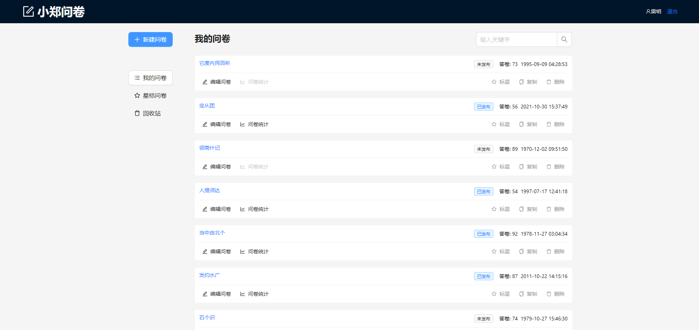

# 问卷系统 (Wenjuan Survey System)

一个功能完整的在线问卷调研系统，采用前后端分离架构，支持问卷创建、编辑、发布、数据收集和统计分析。集成AI智能生成功能，可根据用户需求自动生成问卷模板，大幅提升问卷创建效率。

## 🏗️ 系统架构

本项目采用微服务架构，包含三个独立的模块：

```
wenjuan/
├── wenjuan-fe/           # 问卷管理后台 (React + TypeScript)
├── wenjuan-client/       # 问卷填写客户端 (Next.js)
├── wenjuan-mock/         # 模拟后端服务 (Koa + Mock.js + AI服务)
└── README.md            # 项目整体说明
```

### 模块职责

- **wenjuan-fe**: 问卷管理后台，提供问卷创建、编辑、发布、统计等功能，集成AI生成功能
- **wenjuan-client**: 问卷填写端，用户填写问卷的界面
- **wenjuan-mock**: 后端服务，提供API接口、数据模拟和AI智能生成服务

## 界面展示

#### 主页面：



#### 问卷通用模板：


#### AI辅助：


#### AI辅助基础模板


## 🎯 核心功能

### 用户管理

- ✅ 用户注册/登录
- ✅ 用户信息管理
- ✅ 权限控制

### 问卷管理

- ✅ 问卷创建和编辑（拖拽式编辑器）
- ✅ 问卷列表管理（我的问卷、星标、回收站）
- ✅ 问卷搜索和筛选
- ✅ 问卷复制、发布、删除
- ✅ 问卷模板管理
- ✅ AI智能生成问卷模板（基于用户需求自动生成问卷结构）

### 问卷填写

- ✅ 响应式问卷页面
- ✅ 多种题型支持
- ✅ 表单验证
- ✅ 答案提交

### 数据统计

- ✅ 答卷数据收集
- ✅ 统计图表展示
- ✅ 组件级数据统计
- ✅ 数据导出功能

## 🛠️ 技术栈

### 前端技术

- **React 18** - 用户界面框架
- **Next.js 13** - 全栈框架
- **TypeScript** - 类型安全
- **Ant Design 5** - UI 组件库
- **Redux Toolkit** - 状态管理
- **Sass** - CSS 预处理器

### 后端技术

- **Koa 2** - Node.js Web 框架
- **Mock.js** - 数据模拟
- **Node.js** - 运行时环境
- **OpenAI API** - AI智能生成服务
- **Axios** - HTTP 客户端
- **JSON5** - JSON 解析库

## 📁 项目结构

```
wenjuan/
├── wenjuan-fe/                    # 问卷管理后台
│   ├── src/
│   │   ├── components/            # 通用组件
│   │   ├── pages/                 # 页面组件
│   │   │   ├── Home.tsx          # 首页
│   │   │   ├── Login.tsx         # 登录页
│   │   │   ├── Register.tsx      # 注册页
│   │   │   ├── manage/           # 管理页面
│   │   │   └── question/         # 问卷相关页面
│   │   ├── services/             # API 服务
│   │   ├── store/                # Redux 状态管理
│   │   ├── hooks/                # 自定义 Hooks
│   │   └── styles/               # 样式文件
│   └── README.md
├── wenjuan-client/                # 问卷填写客户端
│   ├── src/
│   │   ├── components/           # 问卷组件
│   │   ├── pages/               # 页面路由
│   │   │   ├── question/[id].tsx # 问卷详情页
│   │   │   ├── success.tsx      # 提交成功页
│   │   │   └── fail.tsx         # 提交失败页
│   │   ├── services/            # API 服务
│   │   └── styles/              # 样式文件
│   └── README.md
├── wenjuan-mock/                  # 模拟后端服务
│   ├── mock/                    # Mock 数据配置
│   │   ├── user.js              # 用户接口
│   │   ├── question.js          # 问卷接口
│   │   ├── stat.js              # 统计接口
│   │   └── data/                # 数据生成器
│   ├── services/                # AI 服务模块
│   │   └── chatgpt.js           # ChatGPT API 服务
│   ├── index.js                 # 服务入口
│   └── README.md
└── README.md                     # 项目整体说明
```

## 🚀 快速开始

### 环境要求

- Node.js >= 16.0.0
- npm >= 8.0.0
- OpenAI API Key（可选，用于AI生成功能）

### 安装依赖

```bash
# 安装问卷管理后台依赖
cd wenjuan-fe
npm install

# 安装问卷填写端依赖
cd ../wenjuan-client
npm install

# 安装模拟后端依赖
cd ../wenjuan-mock
npm install
```

### 环境变量配置

在 `wenjuan-mock` 目录下创建 `.env` 文件，配置 OpenAI API Key：

```bash
# wenjuan-mock/.env
OPENAI_API_KEY=your_openai_api_key_here
```

**注意**：如果不配置 API Key，系统将使用模拟数据生成问卷模板。

### 启动所有服务

```bash
# 1. 启动模拟后端服务 (端口: 3001)
cd wenjuan-mock
npm run dev

# 2. 启动问卷管理后台 (端口: 3000)
cd ../wenjuan-fe
npm start

# 3. 启动问卷填写端 (端口: 3002)
cd ../wenjuan-client
npm run dev
```

### 访问地址

- **问卷管理后台**: [http://localhost:3000](http://localhost:3000)
- **问卷填写端**: [http://localhost:3002](http://localhost:3002)
- **模拟后端API**: [http://localhost:3001](http://localhost:3001)

## 🔄 模块协作流程

### 1. 问卷创建流程

```
用户 → wenjuan-fe → wenjuan-mock → 数据库
```

1. 用户在管理后台创建问卷
2. 调用 wenjuan-mock 的创建接口
3. 返回问卷ID，跳转到编辑页面

### 1.1 AI智能生成流程

```
用户输入需求 → wenjuan-fe → wenjuan-mock → AI服务 → 生成问卷模板
```

1. 用户点击创建问卷，输入需求描述
2. 前端调用AI生成接口 `/api/question/llm/:id`
3. 后端调用OpenAI API生成问卷组件列表
4. 返回生成的问卷模板，用户可直接编辑

### 2. 问卷编辑流程

```
wenjuan-fe → wenjuan-mock → 实时保存
```

1. 加载问卷数据
2. 拖拽编辑组件
3. 实时保存到后端

### 3. 问卷发布流程

```
wenjuan-fe → wenjuan-mock → 发布状态更新
```

1. 编辑完成后发布问卷
2. 生成问卷链接
3. 用户可通过链接访问

### 4. 问卷填写流程

```
用户 → wenjuan-client → wenjuan-mock → 答案存储
```

1. 用户访问问卷链接
2. 填写问卷内容
3. 提交答案到后端

### 5. 数据统计流程

```
wenjuan-fe → wenjuan-mock → 统计数据展示
```

1. 查看问卷统计
2. 加载答卷数据
3. 生成统计图表

## 🔌 接口规范

### 统一响应格式

```typescript
interface ApiResponse {
  errno: number;        // 错误码，0表示成功
  data?: any;          // 响应数据
  msg?: string;        // 错误信息
}
```

### 主要接口

#### 用户相关

- `GET /api/user/info` - 获取用户信息
- `POST /api/user/register` - 用户注册
- `POST /api/user/login` - 用户登录

#### 问卷相关

- `GET /api/question` - 获取问卷列表
- `GET /api/question/:id` - 获取问卷详情
- `POST /api/question` - 创建问卷
- `PATCH /api/question/:id` - 更新问卷
- `POST /api/question/duplicate/:id` - 复制问卷
- `DELETE /api/question` - 删除问卷

#### 统计相关

- `GET /api/stat/:questionId` - 获取答卷列表
- `GET /api/stat/:questionId/:componentId` - 获取组件统计

#### 答案提交

- `POST /api/answer` - 提交问卷答案

#### AI生成相关

##### AI智能生成问卷模板

```http
POST /api/question/llm/:id
```

**请求体：**

```json
{
  "llm": "用户需求描述"
}
```

**响应示例：**

```json
{
  "errno": 0,
  "data": {
    "id": "question_001",
    "title": "AI生成的问卷标题",
    "desc": "AI生成的问卷描述",
    "componentList": [
      {
        "fe_id": "c1",
        "type": "questionInfo",
        "title": "问卷信息",
        "props": {
          "title": "问卷标题",
          "desc": "问卷描述"
        }
      }
    ]
  }
}
```

**功能说明：**

- 根据用户输入的需求描述，使用AI自动生成问卷模板
- 支持生成多种题型：单选、多选、输入框、文本域等
- 当API Key未配置时，自动降级为模拟数据生成

## 🎨 组件系统

### 问卷组件类型

#### 文本显示组件

- **QuestionTitle**: 标题组件
- **QuestionParagraph**: 段落组件
- **QuestionInfo**: 信息展示组件

#### 用户输入组件

- **QuestionInput**: 单行文本输入
- **QuestionTextarea**: 多行文本输入

#### 用户选择组件

- **QuestionRadio**: 单选题
- **QuestionCheckbox**: 多选题

### 组件特性

- 统一的组件接口
- 拖拽式编辑器
- 实时预览
- 属性配置
- 统计展示

## 📊 数据流架构

### 状态管理

- **wenjuan-fe**: Redux Toolkit 管理全局状态
- **wenjuan-client**: 本地状态管理
- **wenjuan-mock**: 内存数据存储

### 数据持久化

- 问卷数据实时保存
- 支持撤销/重做功能
- 本地存储用户偏好

## 🔧 开发指南

### 开发环境配置

#### 环境变量配置

```bash
# wenjuan-fe/.env.development
REACT_APP_API_URL=http://localhost:3001

# wenjuan-client/.env.local
NEXT_PUBLIC_API_URL=http://localhost:3001

# wenjuan-mock/.env
OPENAI_API_KEY=your_openai_api_key_here
```

#### 跨域配置

wenjuan-mock 已配置 CORS 支持跨域请求。

#### AI功能开发

- **AI服务模块**: `wenjuan-mock/services/chatgpt.js`
- **API接口**: `POST /api/question/llm/:id`
- **前端组件**: `wenjuan-fe/src/components/QuestionTitleModal.tsx`
- **降级策略**: 当API Key未配置时，自动使用模拟数据生成问卷模板

### 代码规范

- ESLint + Prettier 代码格式化
- TypeScript 类型检查
- Git 提交规范

### 测试策略

- 单元测试
- 集成测试
- 端到端测试

## 🚀 部署方案

### 开发环境

```bash
# 本地开发
npm run dev
```

### 生产环境

```bash
# 构建生产版本
npm run build

# 启动生产服务
npm start
```

### 部署架构

```
用户 → CDN → 前端应用 → 后端API → 数据库
```

## 📱 响应式设计

- 支持桌面端和移动端
- 自适应布局
- 触摸友好的交互设计

## 🔒 安全考虑

### 前端安全

- XSS 防护
- CSRF 防护
- 输入验证

### 后端安全

- 接口鉴权
- 数据验证
- 错误处理

## 📈 性能优化

### 前端优化

- 代码分割
- 懒加载
- 缓存策略

### 后端优化

- 接口缓存
- 数据库优化
- 负载均衡

## 🤝 贡献指南

1. Fork 项目
2. 创建功能分支 (`git checkout -b feature/AmazingFeature`)
3. 提交更改 (`git commit -m 'Add some AmazingFeature'`)
4. 推送到分支 (`git push origin feature/AmazingFeature`)
5. 创建 Pull Request


## 📞 联系方式

如有问题或建议，请通过以下方式联系：

- 提交 Issue
- 发送邮件至项目维护者

---

**注意**: 本项目目前使用 Mock 数据进行开发，生产环境需要对接真实的后端服务和数据库。
